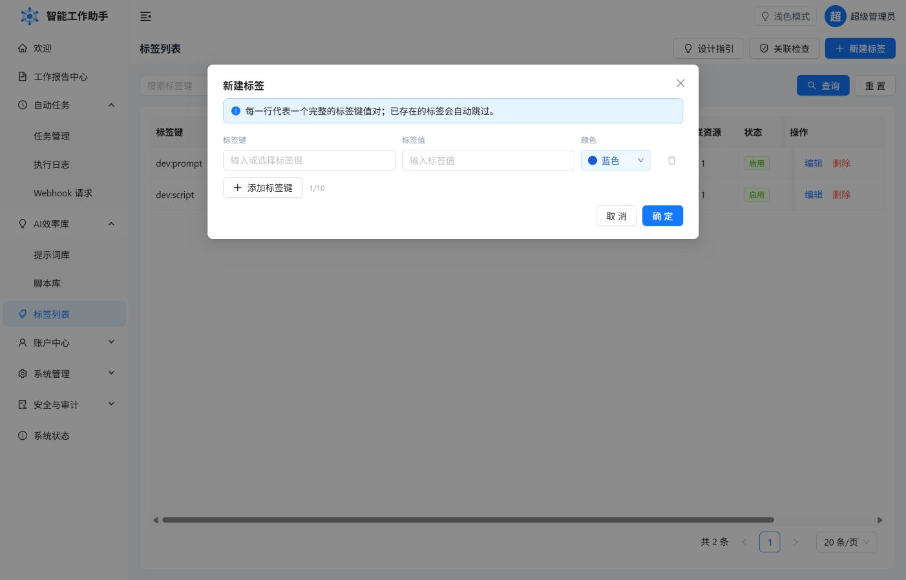

标签由完整的 `键 + 值` 组成，例如 `场景 = 周报`、`部门 = 研发`。它们可以同时用于提示词、脚本和自动任务，但不会改变任何资源的访问权限。

## 设计一套好用的标签

- 一个键只表达一个维度，例如“场景”“项目”“状态”。
- 值保持有限、稳定，避免同义词和随意缩写。
- 不要用标签重复名称、分类、启停状态等系统已有字段。
- 同一资源可以绑定同一键下的多个值。

_每一行代表一个完整的键值标签；颜色只帮助识别，不会影响筛选和权限。_

## 筛选规则

选择多个标签筛选时使用 AND 语义：资源必须同时满足所有已选标签，才会出现在结果中。

## 启用、停用与删除

- 停用标签后，不能再建立新的绑定，但已有绑定仍会显示。
- 已被资源引用的标签不能删除；先从相关资源解除绑定。
- 标签只属于当前用户。公共脚本对非所有者不展示标签，复制后也不会继承原标签。
